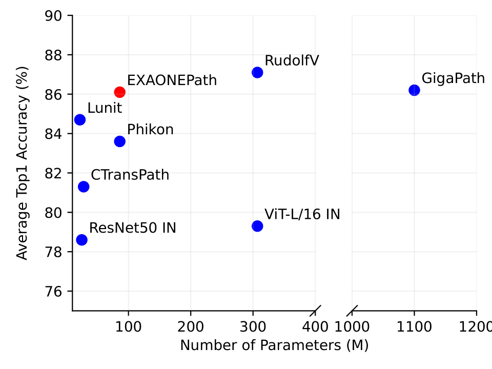
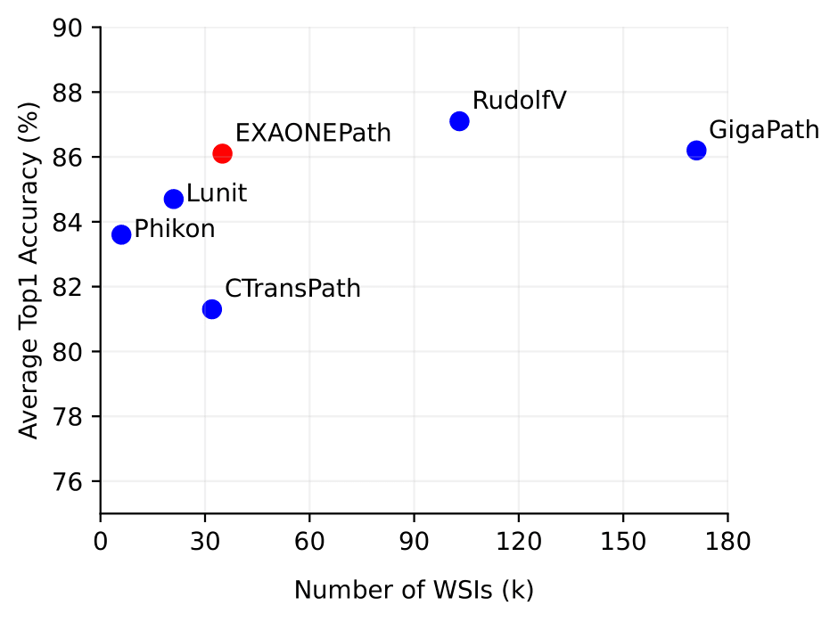

# EXAONEPath

## Enhancing Whole Slide Pathology Foundation Models Through Stain Normalization

[[`Model`](https://github.com/st24hour/EXAONEPath/releases/download/1.0.0/EXAONEPath.ckpt)] [[`Paper`](https://arxiv.org/abs/2408.00380)] [[`BibTeX`](#Citation)]


<!-- ## Updates: -->

<!-- ## Install -->


## Model Download
The EXAONEPath model checkpoint can be downloaded [here](https://github.com/st24hour/EXAONEPath/releases/download/1.0.0/EXAONEPath.ckpt)

## Inference
Load EXAONEPath and running inference to tile level images.
```python
import torch
from PIL import Image
from macenko import macenko_normalizer
import torchvision.transforms as transforms
from vision_transformer import vit_base

file_path = "./EXAONEPath.ckpt"
checkpoint = torch.load(file_path, map_location=torch.device('cpu'))
state_dict = checkpoint['state_dict']
model = vit_base(patch_size=16, num_classes=0)
msg = model.load_state_dict(state_dict, strict=False)
print(f'Pretrained weights found at {file_path} and loaded with msg: {msg}')

transform = transforms.Compose(
    [
        transforms.Resize(256, interpolation=transforms.InterpolationMode.BICUBIC),
        transforms.CenterCrop(224),
        transforms.Normalize(mean=(0.485, 0.456, 0.406), std=(0.229, 0.224, 0.225)),
    ]
)


normalizer = macenko_normalizer()
img_path = "images/MHIST_aaa.png"
image = Image.open(img_path).convert("RGB")
image_macenko = normalizer(image)

sample_input = transform(image_macenko).unsqueeze(0)
model.cuda()
model.eval()

features = model(sample_input.cuda())
```

## Model Performance Comparison

We report linear evaluation result on six downstream tasks. Top-1 accuracy is shown, with values for models other than Gigapath taken from the RudolfV paper.

| Model                    | PCAM      | MHIST     | CRC-100K  | TIL Det.  | MSI CRC   | MSI STAD  | Avg       |
|--------------------------|-----------|-----------|-----------|-----------|-----------|-----------|-----------|
| ResNet50 ImageNet        | 0.833     | 0.806     | 0.849     | 0.915     | 0.653     | 0.664     | 0.787     |
| ViT-L/16 ImageNet        | 0.852     | 0.796     | 0.847     | 0.924     | 0.669     | 0.671     | 0.793     |
| Lunit                    | 0.918     | 0.771     | 0.949     | 0.943     | 0.745     | 0.756     | 0.847     |
| CTransPath               | 0.872     | 0.817     | 0.840     | 0.930     | 0.694     | 0.726     | 0.813     |
| Phikon                   | 0.906     | 0.795     | 0.883     | **0.946** | 0.733     | 0.751     | 0.836     |
| Virchow                  | 0.933     | **0.834** | 0.968     | -         | -         | -         | -         |
| RudolfV                  | 0.944     | 0.821     | **0.973** | 0.943     | 0.755     | 0.788     | **0.871** |
| GigaPath (patch encoder) | **0.947** | 0.822     | 0.964     | 0.938     | 0.753     | 0.748     | 0.862     |
| SNPath (ours)            | 0.901     | 0.818     | 0.946     | 0.939     | **0.756** | **0.804** | 0.861     |

<br>

<figure>
    <div style="display: flex; justify-content: center; gap: 10px;">
        
        
    </div>
    <figcaption style="text-align: left;">
        <strong>Figure 1. Performance comparison of models based on the number of parameters and the number of WSIs used for training.</strong> The average Top-1 accuracy represents the mean linear evaluation performance across six downstream tasks.
    </figcaption>
</figure>


## Citation
If you find EXAONEPath useful, please cite it using this BibTeX:
```
@techreport{yun2024enhancing,
    title={Enhancing Whole Slide Pathology Foundation Models Through Stain Normalization},
    author={Juseung Yun and Yi Hu and Jinhyung Kim and Jongseong Jang and Soonyoung Lee},
    year={2024},
    institution={arXiv},
    number={2408.00380},
    type={eprint},
    note={To appear}
}
```